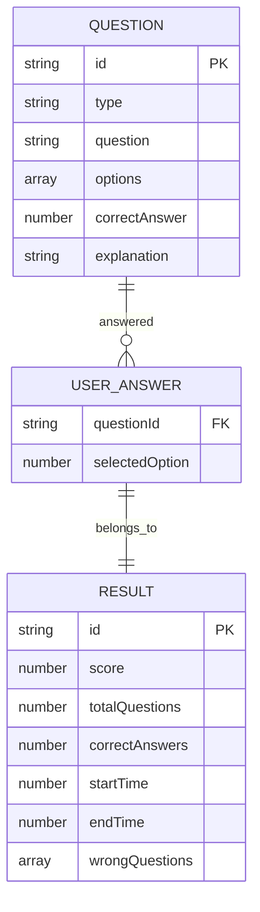

## 1. 架构设计

```mermaid
graph TB
    subgraph "前端层"
        "React App" --> "React Router"
        "React App" --> "State Management"
        "React App" --> "UI Components"
    end

    subgraph "后端层"
        "Express Server" --> "API Routes"
        "API Routes" --> "Question Service"
        "API Routes" --> "Result Service"
    end

    subgraph "数据层"
        "JSON Files" --> "题目数据"
        "JSON Files" --> "用户答案"
    end

    "React App" -->|"HTTP请求"| "Express Server"
    "Express Server" -->|"读取/写入"| "JSON Files"
```

## 2. 技术描述

- 前端: React@18 + tailwindcss@3 + vite
- 初始化工具: vite-init
- 后端: Express@4
- 数据库: 使用JSON文件存储题目数据和结果数据
- 自动Pipeline: 提交后自动执行评分流程

## 3. 路由定义

| 路由 | 用途 |
|------|------|
| / | 首页，展示题型选择 |
| /quiz/:type | 答题页面，type为题型（grammar/vocabulary/reading） |
| /result/:id | 结果页面，显示答题结果和解析 |

## 4. API定义

### TypeScript类型定义

```typescript
// 题目类型
interface Question {
  id: string;
  type: 'grammar' | 'vocabulary' | 'reading';
  question: string;
  options: string[];
  correctAnswer: number;
  explanation: string;
}

// 用户答案
interface UserAnswer {
  questionId: string;
  selectedOption: number;
}

// 提交请求
interface SubmitRequest {
  answers: UserAnswer[];
  startTime: number;
  endTime: number;
}

// 提交响应
interface SubmitResponse {
  resultId: string;
  score: number;
  totalQuestions: number;
  correctAnswers: number;
  timeSpent: number;
  wrongQuestions: Array<{
    question: Question;
    userAnswer: number;
  }>;
}

// 结果查询响应
interface ResultResponse extends SubmitResponse {}
```

### API端点

| 端点 | 方法 | 描述 |
|------|------|------|
| /api/questions/:type | GET | 获取指定类型的题目列表 |
| /api/submit | POST | 提交答案并触发自动评分 |
| /api/result/:id | GET | 获取答题结果详情 |

## 5. 服务器架构图

```mermaid
graph LR
    "Controller" --> "Service"
    "Service" --> "Repository"
    "Repository" --> "JSON Files"
```

### 各层职责

- **Controller**: 处理HTTP请求，验证参数，返回响应
- **Service**: 业务逻辑处理，包括评分算法、时间计算
- **Repository**: 数据访问层，读取题目数据和保存结果数据

## 6. 数据模型

### 6.1 数据模型定义



### 6.2 数据定义语言

#### 题目数据示例 (questions.json)
```json
{
  "grammar": [
    {
      "id": "g001",
      "question": "次の文の______に入れるのに最もよいものを、1・2・3・4から一つ選びなさい。\n\n彼は昨日、会社を______しまった。",
      "options": ["休んで", "休みて", "休むて", "休みんで"],
      "correctAnswer": 0,
      "explanation": "动词「休む」的て形是「休んで」，表示动作的中顿或原因。"
    }
  ],
  "vocabulary": [
    {
      "id": "v001",
      "question": "次の言葉の意味として最もよいものを、1・2・3・4から一つ選びなさい。\n\nあきらめる",
      "options": ["希望を持つ", "希望を捨てる", "努力する", "諦めない"],
      "correctAnswer": 1,
      "explanation": "「あきらめる」的意思是放弃，与「希望を捨てる」意思最接近。"
    }
  ],
  "reading": [
    {
      "id": "r001",
      "question": "文章の内容と合っているものはどれか、1・2・3・4から一つ選びなさい。\n\n[文章] 日本の電車は時間が正確で有名です。...\n\n問い: 日本の電車について正しい説明はどれか。",
      "options": [
        "いつも遅れる",
        "時間が正確だ",
        "高い",
        "込んでいない"
      ],
      "correctAnswer": 1,
      "explanation": "文章明确提到「時間が正確で有名です」，因此正确答案是「時間が正確だ」。"
    }
  ]
}
```

#### 结果数据示例 (results.json)
```json
{
  "results": [
    {
      "id": "result_001",
      "score": 80,
      "totalQuestions": 10,
      "correctAnswers": 8,
      "startTime": 1234567890000,
      "endTime": 1234567950000,
      "wrongQuestions": [
        {
          "questionId": "g003",
          "userAnswer": 2
        }
      ]
    }
  ]
}
```

## 7. 自动Pipeline流程

### Pipeline触发机制
用户提交答案后，自动执行以下流程：

```mermaid
graph TD
    "接收提交请求" --> "验证数据完整性"
    "验证数据完整性" --> "计算得分"
    "计算得分" --> "生成结果报告"
    "生成结果报告" --> "保存结果"
    "保存结果" --> "返回结果ID"
```

### Pipeline执行步骤

1. **数据验证**: 检查答案格式、题目ID有效性
2. **自动评分**: 对比用户答案与正确答案
3. **时间计算**: 计算答题用时
4. **结果生成**: 创建包含得分、错题列表的完整报告
5. **数据持久化**: 将结果保存到JSON文件
6. **响应返回**: 返回结果ID供前端跳转使用