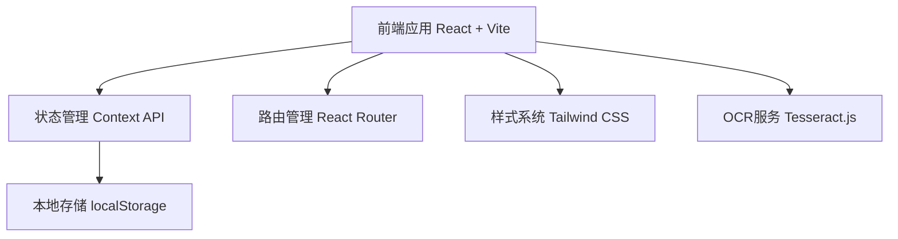
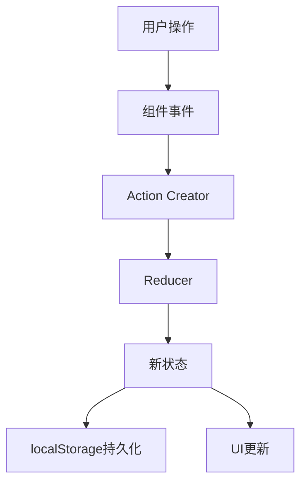

# 日语单词学习应用技术架构

## 1. 架构设计



## 2. 技术说明
- **前端框架**: React 18 + Tailwind CSS 3 + Vite
- **初始化工具**: vite-init
- **后端**: 无（纯前端应用）
- **数据库**: localStorage（浏览器本地存储）
- **OCR识别**: Tesseract.js（开源 OCR 库，支持日语识别）

## 3. 路由定义

| 路由 | 用途 |
|------|------|
| `/` | 首页，显示功能入口和学习概览 |
| `/learn` | 学习页面，展示单词并进行练习 |
| `/vocabulary` | 词库管理页面，管理所有单词 |
| `/import` | 图片导入页面，从图片提取单词 |

## 4. 数据模型

### 4.1 单词数据结构
```typescript
interface VocabularyWord {
  id: string;              // 唯一标识符
  chinese: string;         // 中文意思
  japanese: string;        // 日语写法（汉字/假名）
  romaji?: string;         // 罗马音（可选）
  category?: string;       // 分类（可选）
  level?: string;          // 难度等级（可选）
  learningCount: number;   // 学习次数
  correctCount: number;    // 正确次数
  lastLearned?: Date;      // 最后学习时间
  createdAt: Date;         // 创建时间
}
```

### 4.2 学习进度数据结构
```typescript
interface LearningProgress {
  totalWords: number;      // 总单词数
  learnedWords: number;    // 已学习单词数
  correctRate: number;     // 正确率
  currentSession: {
    startTime: Date;       // 本次学习开始时间
    wordsLearned: number;  // 本次已学习单词数
    correctCount: number;  // 本次正确数
  };
}
```

### 4.3 应用状态结构
```typescript
interface AppState {
  vocabulary: VocabularyWord[];    // 词库
  progress: LearningProgress;      // 学习进度
  settings: {
    dailyGoal: number;             // 每日学习目标
    shuffleMode: boolean;          // 是否随机顺序
    showRomaji: boolean;           // 是否显示罗马音
  };
}
```

## 5. 核心组件架构

### 5.1 组件层级
```
App
├── Header (导航栏)
├── Router
│   ├── HomePage (首页)
│   ├── LearnPage (学习页面)
│   │   ├── WordDisplay (单词展示)
│   │   ├── InputArea (输入区域)
│   │   └── ProgressPanel (进度面板)
│   ├── VocabularyPage (词库管理页面)
│   │   ├── WordList (单词列表)
│   │   ├── WordCard (单词卡片)
│   │   └── AddWordModal (添加单词模态框)
│   └── ImportPage (图片导入页面)
│       ├── ImageUpload (图片上传)
│       └── RecognitionResult (识别结果)
└── Footer (页脚)
```

### 5.2 状态管理
- 使用 React Context API 管理全局状态
- 分离词汇状态、学习进度状态和设置状态
- 使用 useReducer 处理复杂状态逻辑

## 6. 数据流设计



## 7. 功能实现细节

### 7.1 学习算法
- **顺序学习**: 按添加顺序展示单词
- **随机学习**: 打乱顺序展示
- **复习模式**: 优先展示错误率高的单词
- **进度追踪**: 记录每次学习结果，计算正确率

### 7.2 图片识别流程
1. 用户上传图片
2. Tesseract.js 初始化日语语言包
3. 执行 OCR 识别
4. 提取文本内容
5. 用户确认/编辑识别结果
6. 批量导入词库

### 7.3 数据持久化
- 使用 localStorage 存储所有数据
- 每次状态变更自动同步到 localStorage
- 应用启动时从 localStorage 恢复状态
- 提供导出/导入功能（JSON格式）

## 8. 性能优化
- **懒加载**: React.lazy 懒加载页面组件
- **虚拟列表**: 大量单词列表使用虚拟滚动
- **防抖节流**: 输入框输入时使用防抖
- **缓存策略**: OCR 语言包缓存到浏览器

## 9. 用户体验优化
- **即时反馈**: 输入后立即显示正确/错误提示
- **动画效果**: 流畅的页面切换和元素动画
- **快捷键**: 支持 Enter 键提交，Esc 键返回
- **响应式设计**: 适配不同屏幕尺寸