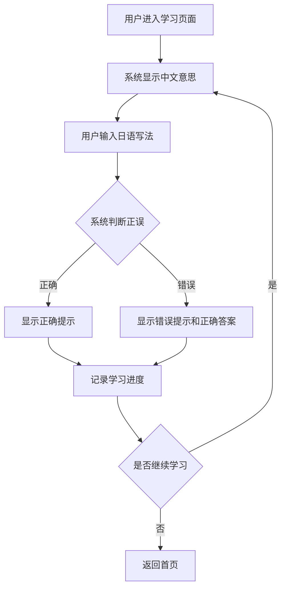
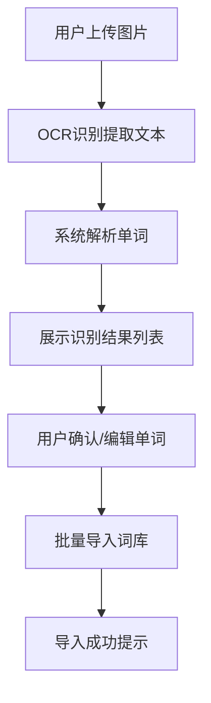

# 日语单词学习应用 PRD

## 1. 产品概述
一款帮助用户高效学习日语单词的Web应用，通过显示中文意思让用户输入日语写法的方式强化记忆，并支持从图片中自动提取单词快速导入词汇库。

- **主要目的**: 提供沉浸式日语单词学习体验，通过"看中文写日文"的方式强化记忆
- **目标用户**: 日语学习者、日语爱好者、备考 JLPT 的学生

## 2. 核心功能

### 2.1 功能模块
1. **学习页面**: 中文提示、日语输入、即时反馈、进度追踪
2. **词库管理页面**: 单词列表、添加/编辑/删除单词、图片导入
3. **图片识别页面**: 上传图片、OCR识别、单词提取、批量导入

### 2.2 页面详情

| 页面名称 | 模块名称 | 功能描述 |
|---------|---------|---------|
| 学习页面 | 单词展示区 | 显示中文意思，提示用户输入日语写法 |
| 学习页面 | 输入区域 | 输入框、提交按钮、实时正确/错误反馈 |
| 学习页面 | 进度面板 | 显示学习进度、正确率、剩余单词数 |
| 词库管理页面 | 单词列表 | 卡片式展示所有单词，支持搜索和筛选 |
| 词库管理页面 | 操作面板 | 添加、编辑、删除单词功能 |
| 图片识别页面 | 图片上传区 | 支持拖拽上传、点击上传图片 |
| 图片识别页面 | 识别结果区 | 显示识别出的单词列表，支持编辑和确认导入 |

## 3. 核心流程

### 3.1 学习流程
用户进入学习页面 → 系统显示中文意思 → 用户输入日语写法 → 系统判断正误 → 显示正确答案和解释 → 记录学习进度 → 进入下一个单词

### 3.2 图片导入流程
用户上传图片 → OCR识别提取文本 → 系统解析单词 → 展示识别结果列表 → 用户确认/编辑 → 批量导入词库

## 4. 用户界面设计

### 4.1 设计风格
- **主色调**: 温暖的米白色背景 (#FFF8F0) + 深灰文字 (#2C3E50) + 樱花粉强调色 (#FFB7C5)
- **次要色调**: 薄荷绿按钮 (#88D8B0) + 浅蓝色辅助 (#AEC6CF)
- **字体**: 标题使用 Noto Sans JP（日文）+ 思源黑体（中文），正文使用系统默认字体
- **布局**: 卡片式设计，居中对齐，响应式布局
- **图标风格**: 扁平化图标，配合柔和的阴影效果
- **动画**: 流畅的过渡动画，正确/错误反馈使用温和的颜色变化

### 4.2 页面设计概览

| 页面名称 | 模块名称 | UI 元素 |
|---------|---------|---------|
| 学习页面 | 单词展示区 | 大号字体显示中文，米白色背景，樱花粉装饰线 |
| 学习页面 | 输入区域 | 圆角输入框，薄荷绿按钮，柔和阴影，实时反馈动画 |
| 学习页面 | 进度面板 | 圆形进度条，数字显示，薄荷绿色调 |
| 词库管理页面 | 单词列表 | 网格卡片布局，每张卡片显示中日文，悬停阴影效果 |
| 词库管理页面 | 操作面板 | 浮动添加按钮，模态框编辑界面，柔和过渡动画 |
| 图片识别页面 | 图片上传区 | 拖拽区域，虚线边框，支持预览，文件类型提示 |
| 图片识别页面 | 识别结果区 | 列表式展示，每项可编辑，批量选择复选框，确认按钮 |

### 4.3 响应式设计
- **桌面优先**: 在大屏幕上展示完整的卡片式布局
- **移动端适配**: 单列布局，优化触摸交互，按钮尺寸适配手指操作
- **平板适配**: 双列卡片布局，平衡内容展示和操作空间

## 5. 数据存储
- **本地存储**: 使用 localStorage 存储用户词库和学习进度
- **数据结构**: 包含单词ID、中文、日语、学习次数、正确率等字段